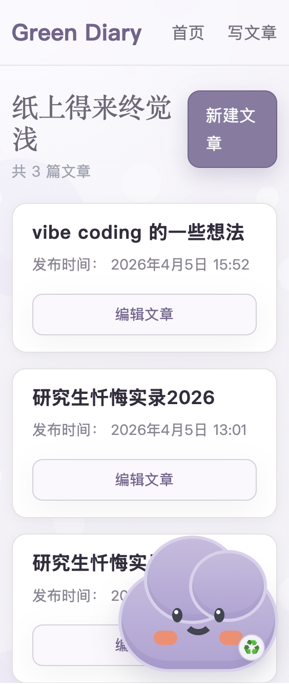
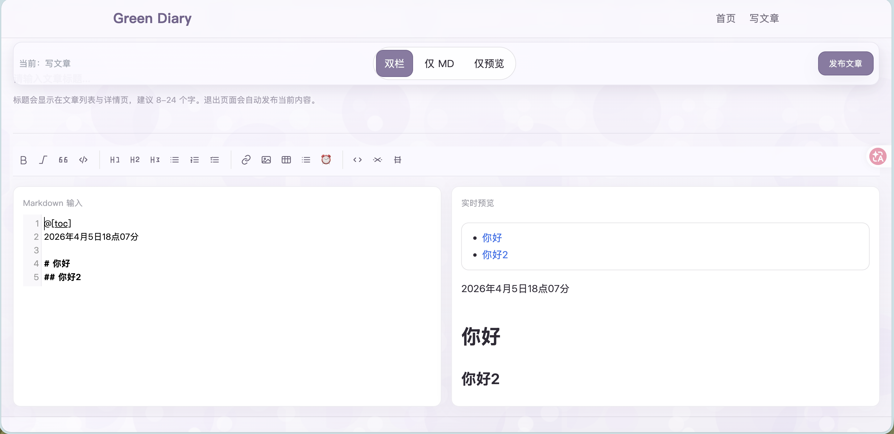
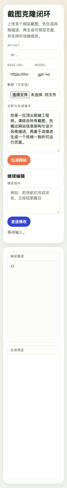
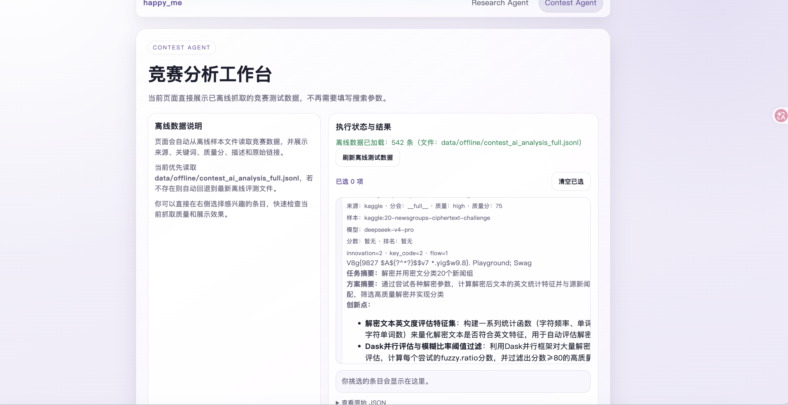
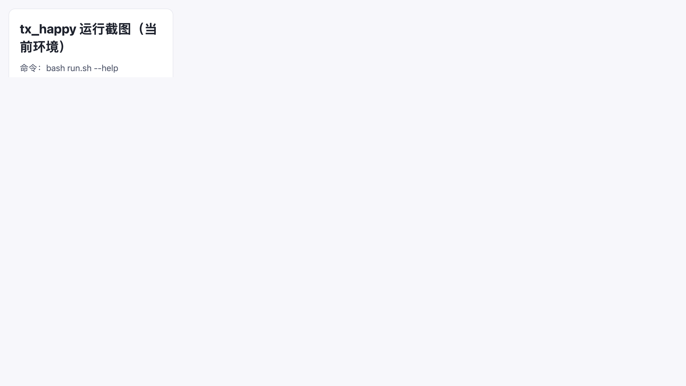
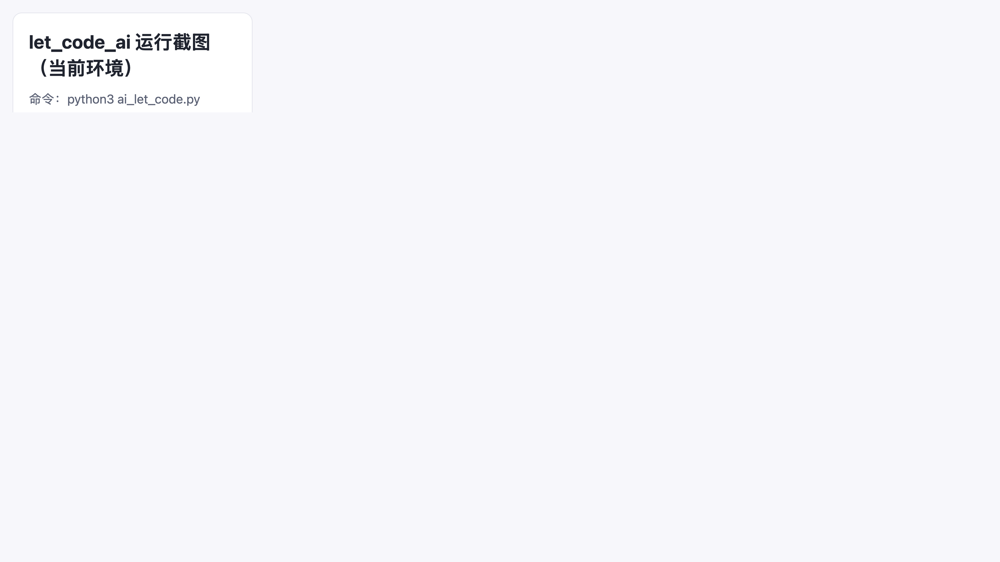

<div align="center">

# 🎵 ai_coding_projects

## 这是我关于 **vibe coding** 的真心话

> 不是「完美的作品集」，而是**真实的工程成长记录**
>
> 用真实需求驱动 → 允许失败并学习 → 把思考过程写清楚

---

</div>

这不是一个「全都成功」的作品集，而是我的**真实工程成长记录**。我把它当成一个长期实验：

1. 🎯 **用真实需求驱动项目**，而不是只做教程式 demo。
2. 🚫 **允许失败**，并记录为什么失败、学到什么。
3. 📝 **把过程和结论写清楚**，给未来的自己看。

**核心信念：最好的代码，来自最真实的问题。**

仓库地址：https://github.com/maoshanwen/ai_coding_projects

---

## 📌 这个仓库想表达什么

这不是一个「全都成功」的作品集，而是**真实的工程成长记录**：

1. ✅ 有些项目解决了我**每天真会用**的问题。
2. ⚙️ 有些项目**方向判断对了**，但工程投入和产出不划算，所以停止。
3. 💎  有些项目虽然结果一般，但留下了**值得复用的方法论**。

我希望自己始终做到的是：

1. 🔍 **独立定义问题**。
2. ⚡ **做工程取舍**。
3. 🧠 **从失败里抽象出可迁移的认知**。

## 项目总览（目的 + 设计 + 结果）

### 1️⃣ **green_diary** 📝

🎯 **目标**：做一个我自己愿意**每天使用**的写作工具。

**背景**：我平时一直用 CSDN 写文档做记录，但页面样式和编辑体验总差点意思。我想要一个更像「**自己工作台**」的工具：界面是我喜欢的，功能是我常用的，不用迁就平台默认逻辑。

功能设计：

1. Flask + SQLite 的轻量架构，启动成本低。
2. Markdown 编辑、预览、发布、回收站恢复。
3. 支持图片上传，方便知识记录。
4. 保持可扩展，后续可加“插入当前时间”等我常用功能。

运行示例：

```bash
cd green_diary
pip install -r requirements.txt
python app.py
```

访问：

- 首页：http://127.0.0.1:5000/
- 编辑器：http://127.0.0.1:5000/editor

**结果与思考** 💭：这个项目对我是**真正有长期价值**的。它不是为了比赛，不是为了 demo，而是我**每天会用来写东西、沉淀思路的工具**。对我来说，它证明了 **vibe coding** 最实在的一点：

> 💎 **先把自己真正痛的点解决掉。**

运行截图：




### 2️⃣ **clone_web** 🎨

🎯 **目标**：从「好看的网页截图」反推设计结构，辅助我自己的页面设计。

**背景**：我发现很多 AI 生成网页有明显「同质化」问题，看久了很容易审美疲劳。所以我当时想做一件事：通过别的网页截图做理解和分析，**把我觉得好的设计迁移到自己的页面里**。

功能设计：

1. FastAPI + SQLite，支持会话与版本管理。
2. 支持多截图输入，首版生成后可继续对话修改。
3. 前端可视化预览，形成最小闭环。

运行示例：

```bash
cd clone_web
pip install -r requirements.txt
uvicorn app.main:app --reload
```

**结果与思考** 💭：

1. ✅ 这条路在**配色、字体、布局**这些「结构层」上是有效的。
2. ❌ 但到了真正影响审美的**细节动画和节奏感**，我当时的分析模型能力还不够，效果只能做到「大概像」。
3. 🛑  我不想在一个**边际收益快速下降的方向里死磕**，所以先停掉，保留方法，后面有更强模型再回头做。

运行截图：



### 3️⃣ **face** 🎭

🎯 **目标**：做一个有**个人风格**的「非露脸内容创作」换脸/特效工具。

**背景**：我自己想做自媒体，但又不想露脸。市面上的换脸玩法多数比较单一，我想做一个**更有个人特色、可自定义程度更高**的版本。

功能设计：

1. 前端实时处理框架（画布、参数面板、录制）。
2. 关键点检测和变形层接口预留，便于后续替换模型。
3. 先做可运行骨架，再做效果迭代。

运行示例：

```bash
cd face
npm install
npm run dev
```

**结果与思考** 💭：这个方向如果不引入**更强模型**，效果上限很快就会碰到**天花板**。项目本身让我更清楚地认识到「**工程实现**」和「**模型能力**」之间的边界，所以我选择暂缓，不把时间投入到短期看不到突破的位置。

> 👁️ 这是一个很重要的认知：**有时候停止一个项目，比死磕更聪明。**


运行截图：


### 4️⃣ **happy_me** 🤖

🎯 **目标**：把「科研任务」和「竞赛任务」拆成**双 Agent**，自动抓取信息并产出建议。

**背景**：这个项目的出发点其实很现实。我当时一边要处理科研汇报，一边又想把时间投入竞赛和我真正感兴趣的方向，于是想做一个**双 Agent**：一条线管科研，一条线管竞赛，**自动抓数据、自动分析、自动产出可用结论**。

功能设计：

1. FastAPI 统一任务入口。
2. Celery + Redis 异步执行。
3. 双路由：research / contest。
4. 多源数据连接器 + 聚类分析。

运行示例：

```bash
cd happy_me
pip install -e '.[dev]'
./scripts/run_api.sh
./scripts/run_worker.sh
```

**结果与思考** 💭：

1. ⭐ **竞赛侧**整体做得更顺，数据链路和输出质量都有持续价值。
2. 📊 **科研侧**虽然能给出很多结论，但我没有足够时间逐条审阅和消化，实际使用成本偏高。
3. 🔄 所以我后面把重心迁到**竞赛深挖**，并把这部分经验继续沉淀到 tx_happy。

运行截图：




### 5️⃣ **tx_happy** 🏆

**背景与目标**：

**tx_happy** 这个项目是类似一个 **autoresearch** 的项目。我的想法是把**天池和 Kaggle 的优秀方案**迁移到腾讯 baseline，然后做不同创新点的尝试和总结。

实际做下来，最大的问题不是“想法不够多”，而是自动化链路没完全打通。因为腾讯这边只能远程提交代码，这一段自动化最后没接上。

我们具体做了：

1. 13 个单点创新。
2. 10 组组合创新。

这次溃败的一个核心原因也很直接：我们做的是横向组合。按理来说，应该是先确认一个有效点，再在这个点上叠加下一个点，走树状创新，而不是平铺组合。

虽然结果不理想，但我得到几条**很重要的启发**：

1. 💡 **在有限尝试里**（腾讯每天只有两次评估机会），基本只能拿到一个微小局部最优。尤其是最开始选中的大涨点，后续和其他点组合后并不一定继续涨。也许存在很多「小涨点」可以持续递增并达到更优结果，但在尝试次数受限时，我们通常拿不到这个答案。反过来说，如果把尝试次数放到足够大，理论上一定会更接近最佳结果。

2. ⚖️ **放开尝试次数会变好**，但时间成本怎么衡量？这就是为什么我觉得「**大模型预判 + 剪枝**」特别关键。沿着思维链条先判断哪些点一看就不太可能起作用，可以大幅缩短试错时间。但这个「不起作用的点」怎么判断，本质上又依赖**数据源质量**和**模型是否具备足够深入的思考能力**。

3. 🔮 **假设我们烧了很多 token**，而且每次实验都拿到小涨点（我们这次确实是这样），长期来看它到底值不值？这里有很强的隐性成本：
   - 高质量长期数据并不好拿；
   - 用大量试错堆出来的提升，短期成本往往高于一个有经验工程师的人工判断。
   
   但如果**未来 agent 能深入推荐链路每一层**，像人一样持续追 badcase，这条路我依然认为**未来可期**。

运行示例：

```bash
cd tx_happy
bash run.sh
```

运行截图：



### 6️⃣ **let_code_ai** 💻

🎯 **目标**：做一个我刷力扣时「**截图即出题解**」的小工具，**减少在多个页面来回找资料的时间**。

**功能设计**：**单文件快速原型**，强调**实用效率**。

运行示例：

```bash
cd let_code_ai
python ai_let_code.py
```

运行截图：



**延伸思考** 🧠：我一直觉得，**开发者能力不该只由刷题定义**。真正拉开差距的，更多是：

- 🏗️ **架构理解**
- 🔍 **定位问题的能力**
- ⚙️ **工程调试**
- 🤝 **部署协作**

这些「**实战素养**」。这个小工具本质上是在帮我把时间从**低价值检索**里省出来，投到**更有复利的能力建设**上。

> 💎 **时间是最贵的。用工具省下来的每分钟，都应该投向更核心的能力。**

## 🎯 **我的方法论**（这部分比结果更重要）

1. 🚀 **先做最小可运行闭环**，再追求完整功能。
   > MVP 不是「简陋」，而是「专注」。

2. 📌 **把失败当成显式资产**，写清楚「为什么不做了」。
   > 好的失败记录，比成功案例更值钱。

3. 🔄 **每个项目都保留可复现实例**，确保可讲、可演示、可继续迭代。
   > 没有可复现实例的项目，都在「讲故事」。

## 隐私与数据边界

为了避免个人数据泄漏，仓库默认不上传：

1. .env 与密钥文件。
2. 本地数据库（如 green_diary 的 database.db）。
3. 本地上传目录（如 green_diary/static/uploads）。

提交前我会做最小检查：

```bash
git status --short
git diff --name-only --cached
```

## 分支策略

- main
- proj/clone_web
- proj/face
- proj/green_diary
- proj/happy_me
- proj/let_code_ai
- proj/tx_happy

## 快速开始

```bash
git clone https://github.com/maoshanwen/ai_coding_projects.git
cd ai_coding_projects
git checkout main
```
